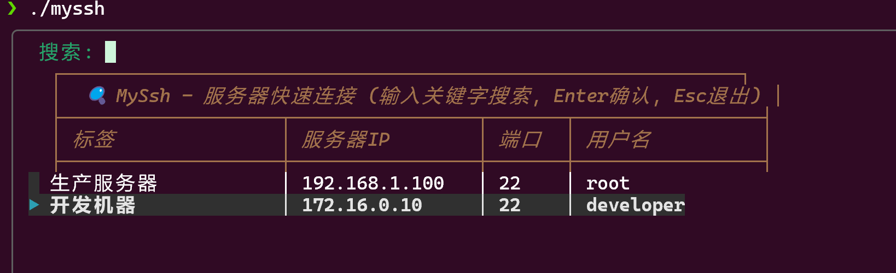

# MySsh

WSL SSH 服务器快速连接工具，支持模糊搜索、sshpass 连接和 WinSCP 文件管理。

## 演示



## 安装

### 1. 安装依赖

```bash
sudo apt install sshpass fzf
```

### 2. 全局安装（可选）

```bash
sudo ln -sf /root/code/TermMate/scripts/myssh /usr/local/bin/myssh
```

## 配置

编辑 `servers.txt` 文件，添加服务器信息：

```
# 支持以下分隔格式（Tab或空格均可）：
标签名  服务器IP  端口  账号  密码

# 示例
生产服务器  192.168.1.100  22  root  password123
测试环境    10.0.0.50      2222  admin  test456
```

## 使用

| 命令 | 说明 |
|------|------|
| `myssh` | 交互式选择服务器并 SSH 连接 |
| `myssh -w` | 交互式选择服务器并用 WinSCP 打开 |
| `myssh -l` | 列出所有服务器 |
| `myssh -e` | 编辑服务器配置文件 |
| `myssh -h` | 显示帮助信息 |

## 环境变量

| 变量 | 说明 | 默认值 |
|------|------|--------|
| `MYSSH_SERVERS_FILE` | 服务器配置文件路径 | `<脚本目录>/servers.txt` |
| `MYSSH_WINSCP_PATH` | WinSCP 可执行文件路径 | `/mnt/c/Users/.../WinSCP.exe` |
